# 🖥️ BlueBus — React Front-End Client Application Repository

[](https://react.dev)
[](https://vite.dev)
[](https://tailwindcss.com)
[](https://axios-http.com)
[](https://leafletjs.com)

The frontend client codebase for the BlueBus Platform. This repository contains the React single-page application built on Vite and Tailwind CSS v4, supporting user booking portals, real-time seat selects, interactive route maps, an AI assistant concierge, and dedicated consoles for administrators and operators.

🔴 **[Explore Live Demo](https://bluebusbooking.vercel.app/)**

---

## 📸 Interactive Interface Gallery

> [!NOTE]
> Save your screenshot files inside the repository's root `docs/screenshots/` directory using the filenames detailed below.

### 1. Customer Booking Experience

<table>
  <tr>
    <td width="50%">
      <h4>A. Home Landing Page</h4>
      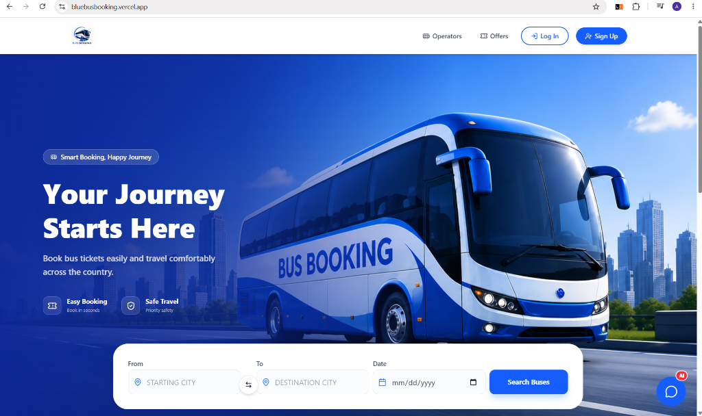
      <p>Clean, high-performance landing page displaying search forms for origin, destination, and departure dates with direct navigation options to operators and active promotional offers.</p>
    </td>
    <td width="50%">
      <h4>B. Intelligent AI Search</h4>
      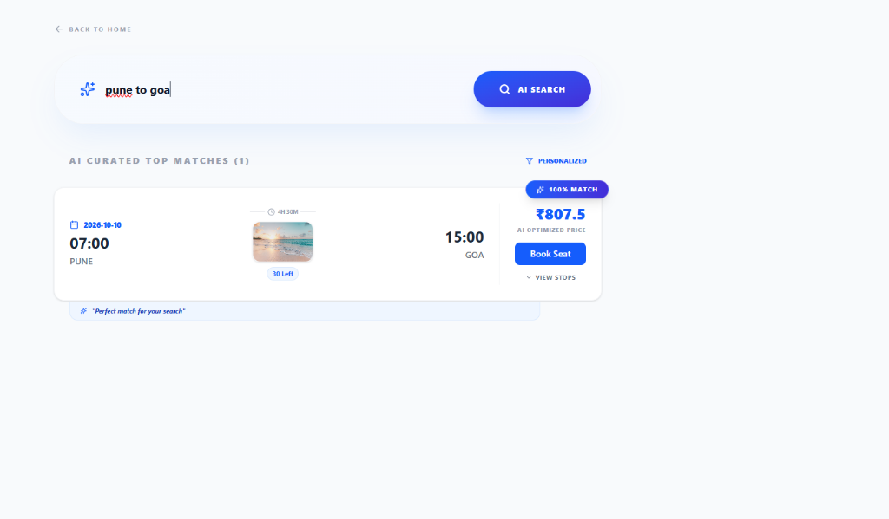
      <p>Natural language search bar. Searches such as <i>"pune to goa"</i> query our AI engine to identify optimal departures, highlighting them with badges like <b>100% Match</b>.</p>
    </td>
  </tr>
  <tr>
    <td width="50%">
      <h4>C. Route Itinerary & Seat Selector</h4>
      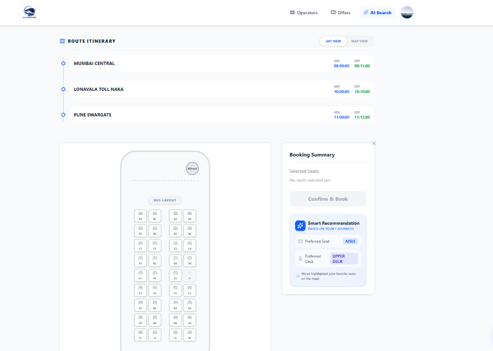
      <p>Interactive bus seat deck mapping (Upper & Lower deck) with real-time seat locks and AI-suggested preferences (e.g. suggesting an <b>Aisle</b> seat based on past journeys).</p>
    </td>
    <td width="50%">
      <h4>D. Journey Route Map Details</h4>
      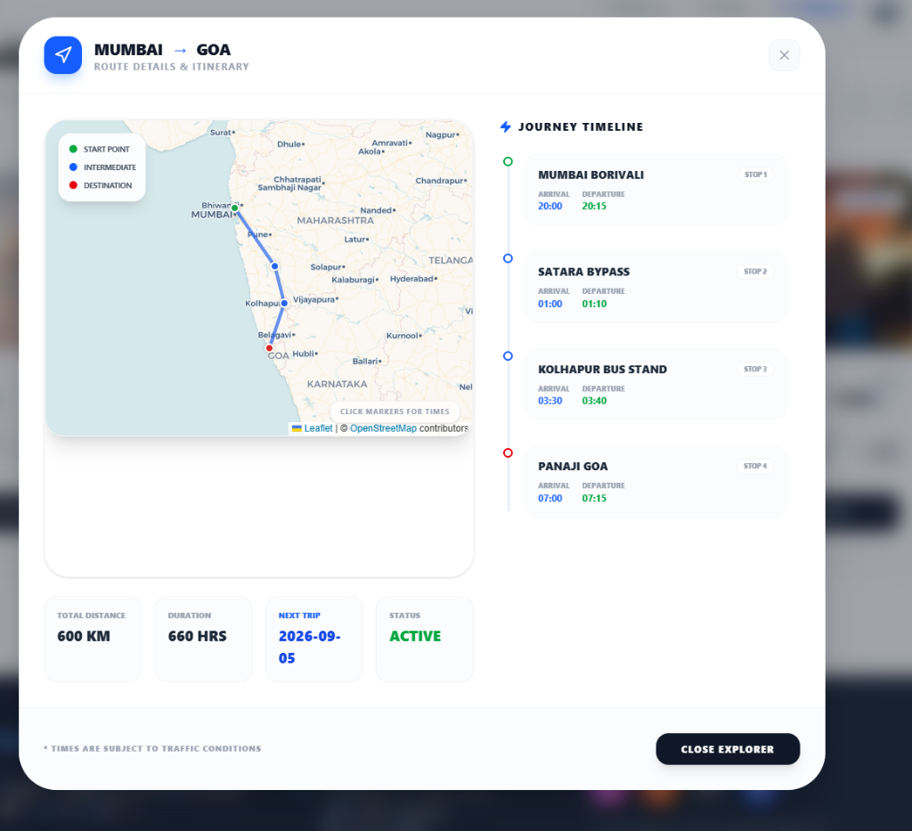
      <p>An interactive map modal displaying the path from starting point to destination using leaflet maps, showing stops (e.g., Satara Bypass, Kolhapur Bus Stand) and specific stop timings.</p>
    </td>
  </tr>
  <tr>
    <td width="50%">
      <h4>E. Unified Checkout & Coupon Code</h4>
      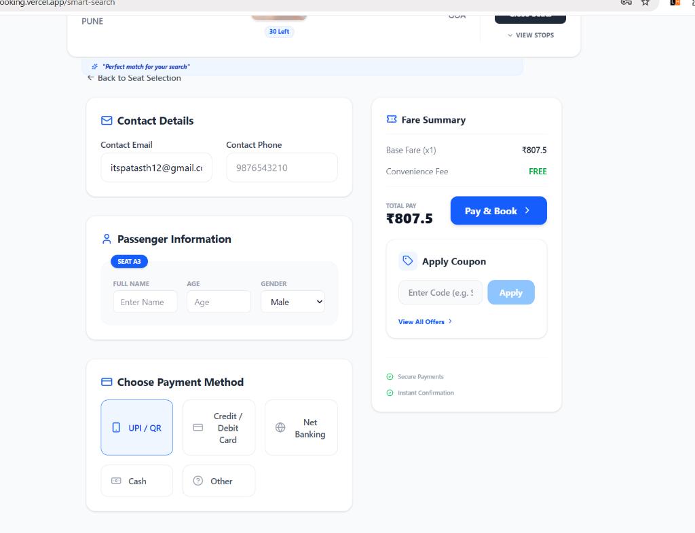
      <p>Consolidated booking drawer capturing passenger information, interactive payment options (UPI, Netbanking, Cards, Cash), and active coupon selector.</p>
    </td>
    <td width="50%">
      <h4>F. Razorpay Gateway Verification</h4>
      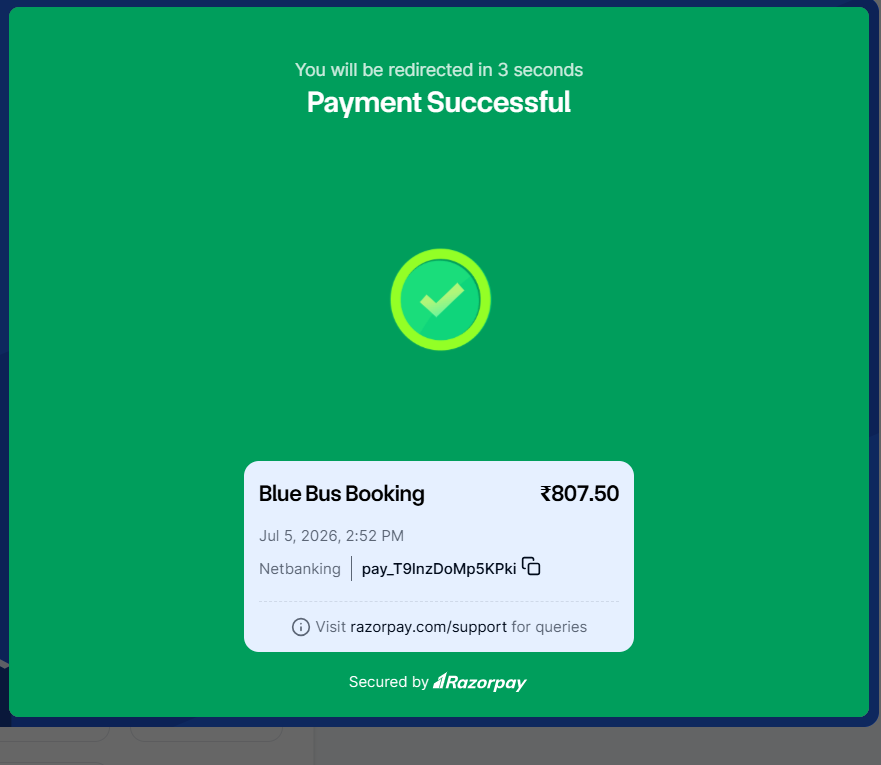
      <p>Embedded Razorpay payment verification popup confirming the capture of booking charges securely.</p>
    </td>
  </tr>
  <tr>
    <td width="50%">
      <h4>G. Confirmed Tickets & QR Scans</h4>
      
      <p>Successful confirmation screen displaying QR codes for boarding, PDF download triggers, and comprehensive trip statistics.</p>
    </td>
    <td width="50%">
      <h4>H. User Bookings Repository</h4>
      
      <p>Personal profile section where users can view history, trace booking statuses (Confirmed/Cancelled), print invoices, or request cancellations.</p>
    </td>
  </tr>
  <tr>
    <td width="100%" colspan="2">
      <h4>I. BlueBus AI Concierge (Chat Assistant)</h4>
      <p align="center">
        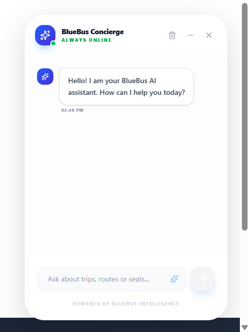
      </p>
      <p align="center">Chatbot widget providing passenger assistance for checking schedules, booking trips, retrieving status details, or processing cancellations using natural language conversations.</p>
    </td>
  </tr>
</table>

### 2. Admin & Operator Management Consoles

<table>
  <tr>
    <td width="50%">
      <h4>A. Main Admin Dashboard</h4>
      
      <p>Comprehensive system health metrics showing gross revenue, active users, booking counts, fleet size, and AI chatbot session analytics.</p>
    </td>
    <td width="50%">
      <h4>B. Strategic Fleet Partners</h4>
      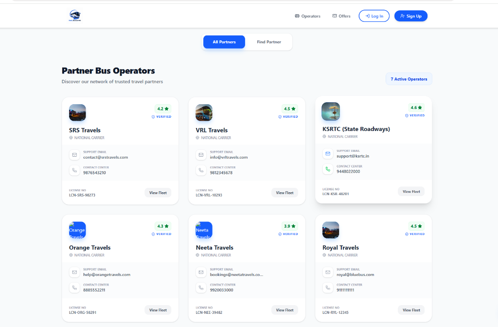
      <p>Operator registry control deck where admins onboard and manage fleet operator accounts (VRL Travels, KSRTC, Orange Travels, Neeta Travels).</p>
    </td>
  </tr>
  <tr>
    <td width="50%">
      <h4>C. Routes & Schedules Architect</h4>
      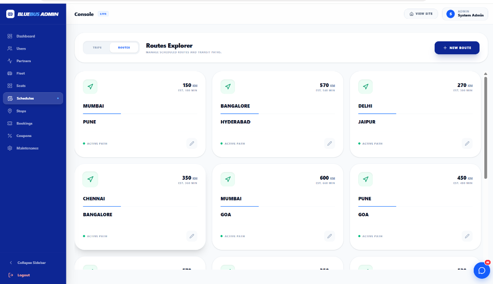
      <p>Route sequence builders allowing administrators to map station stop orders, estimate distances, configure trip timings, and schedule buses.</p>
    </td>
    <td width="50%">
      <h4>D. System Maintenance & Seat-Lock Purge</h4>
      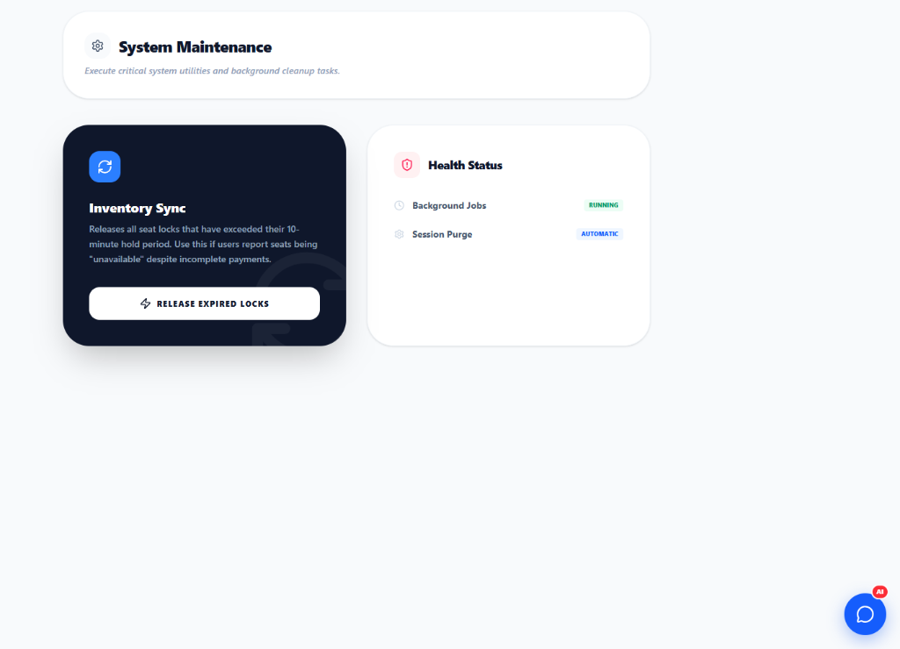
      <p>System tools to release expired 10-minute hold seat locks, reset database configurations, and display general service health status.</p>
    </td>
  </tr>
  <tr>
    <td width="50%">
      <h4>E. Operator Dashboard Summary</h4>
      
      <p>Operator-specific analytics panel displaying total earnings, active units, passenger occupancies, and monthly sales distributions.</p>
    </td>
    <td width="50%">
      <h4>F. Operator Financial Earnings</h4>
      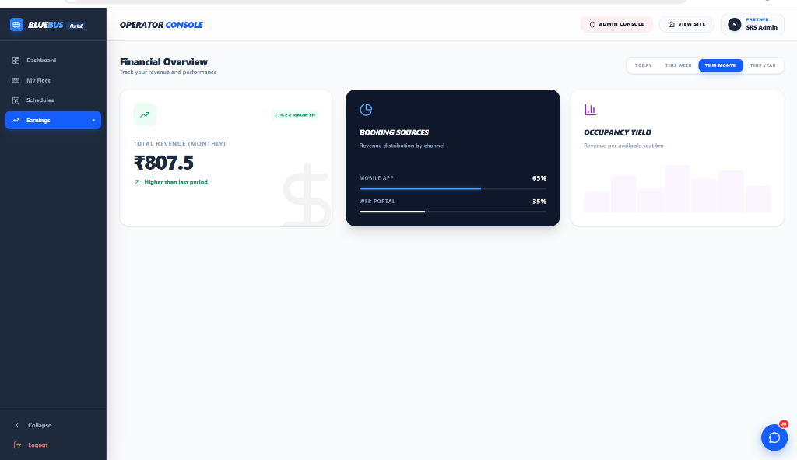
      <p>Visual charts dissecting revenue booking channels (Web Portal vs. Mobile Application) and total yield progress.</p>
    </td>
  </tr>
</table>

---

## 📁 Repository Structure

```
bluebusfrontEnd/                   --> Frontend Repository Root
├── 📁 docs/
│   └── 📁 screenshots/            # UI Showcase Images (Referenced above)
└── 📁 blue-bus-booking/           # Subdirectory containing the React Application
    ├── 📁 src/
    │   ├── 📁 api/                # Axios instance configuration & JWT Interceptors
    │   ├── 📁 assets/             # Static client logo and backdrop images
    │   ├── 📁 Components/         # Feature UI components
    │   │   ├── 📁 AI Chat/        # BlueBus Concierge chatbot UI
    │   │   ├── 📁 AdminDashBoard/ # Admin layout, user lists, stop manager panels
    │   │   ├── 📁 Bookings/       # Boarding passes and confirmation templates
    │   │   ├── 📁 BusOperator/    # Operator settings
    │   │   ├── 📁 OperatorPortal/ # Operator scheduling & analytics
    │   │   ├── 📁 Page1/          # Booking home landing deck
    │   │   ├── 📁 Page2/          # Search results listing and seat grids
    │   │   ├── 📁 Payments/       # Payment options drawers & coupons forms
    │   │   └── 📁 UserComponent/  # Authentication forms & profile handlers
    │   ├── 📝 App.jsx             # Client routes configurations
    │   └── 📝 main.jsx            # Entry react mounter
    ├── 📝 package.json            # NPM scripts & library versions
    └── 📝 vite.config.js          # Vite build details
```

---

## 🛠️ Local Installation & Development

### 1. Prerequisites
- **Node.js** v18.0.0 or higher
- **npm** or **yarn** package manager
- Running instances of the backend service (defaulting to `http://localhost:8080`)

### 2. Setup Procedure
1. Navigate to the application source directory:
   ```bash
   cd blue-bus-booking
   ```
2. Install project dependencies:
   ```bash
   npm install
   ```
3. Launch the Vite hot-reloading development server:
   ```bash
   npm run dev
   ```
4. Open your browser and navigate to the local server port: `http://localhost:5173`.

### 3. Production Build
1. Build optimized static assets for hosting:
   ```bash
   cd blue-bus-booking
   ```
2. Run build script:
   ```bash
   npm run build
   ```
3. Verify the production build locally:
   ```bash
   npm run preview
   ```

---

## ⚙️ Configuration & Environment Variables

The client configures its network request host inside `blue-bus-booking/src/api/axiosConfig.js`.

To configure a production backend endpoint, create a `.env` file inside the `blue-bus-booking/` directory and define:
```properties
VITE_API_BASE_URL=https://your-production-backend.com/api
```

---

## 🚀 Deployment (Vercel)

The frontend is fully configured for deployment on Vercel:

1. **Vercel Settings**:
   - **Framework Preset**: `Vite`
   - **Root Directory**: `blue-bus-booking`
   - **Build Command**: `npm run build`
   - **Output Directory**: `dist`
2. **Redirect Rule configuration**: To allow React Router routes to resolve correctly on page refreshes, ensure a `vercel.json` file is present in the `blue-bus-booking/` directory:
   ```json
   {
     "rewrites": [
       { "source": "/(.*)", "destination": "/index.html" }
     ]
   }
   ```
