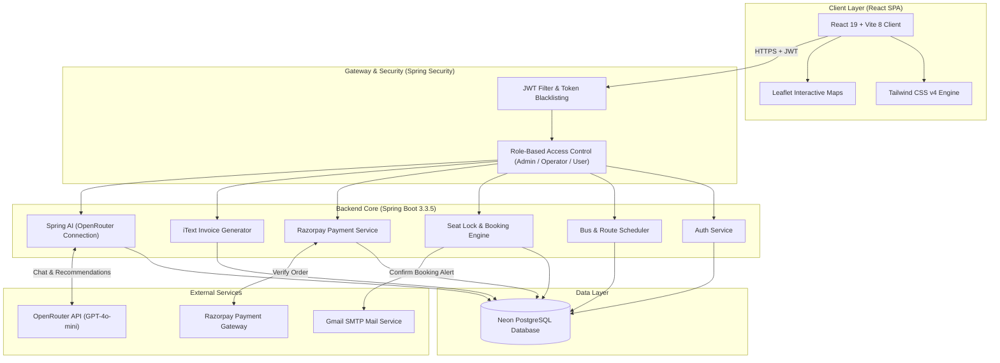
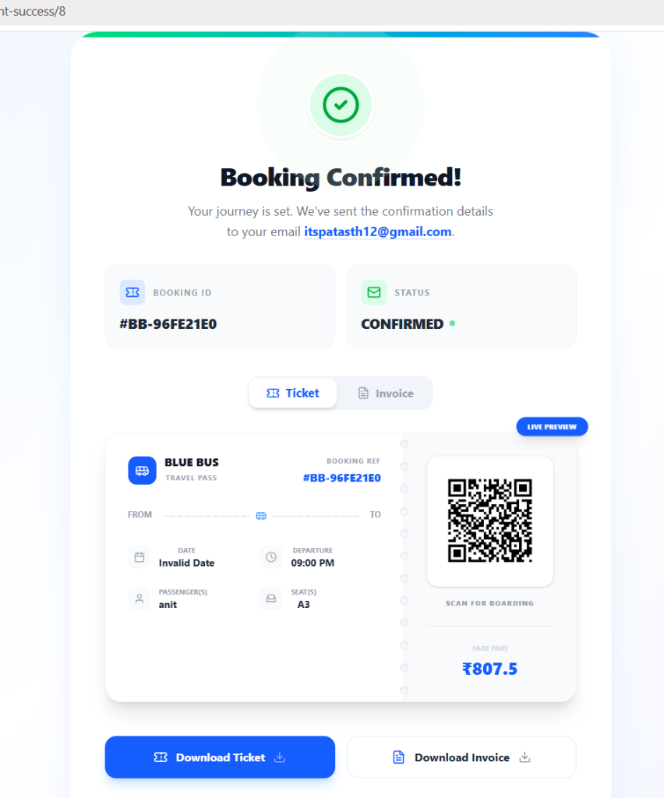
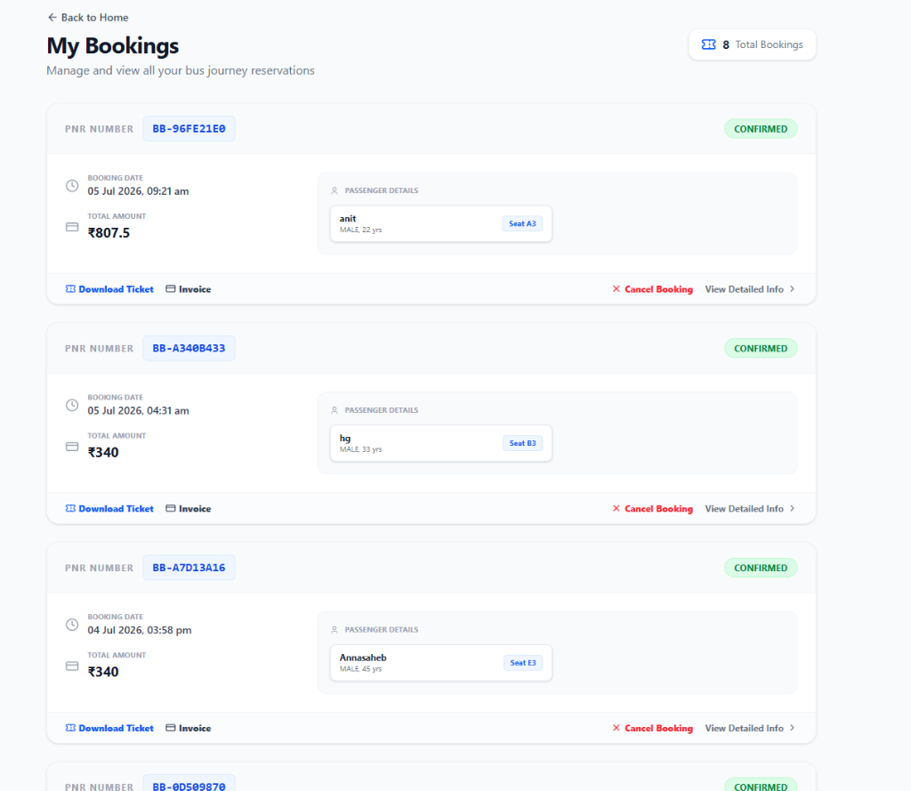
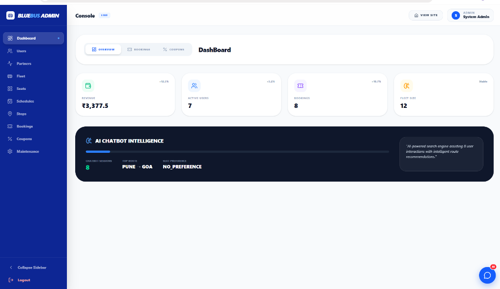
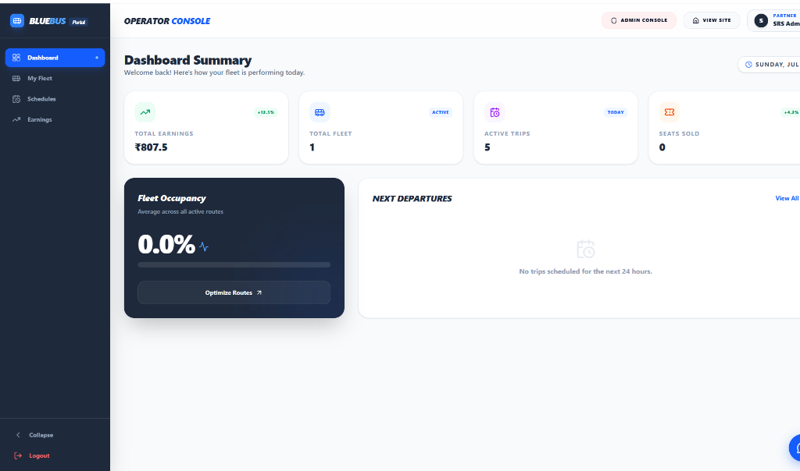

# 🚌 BlueBus — Full-Stack AI-Powered Bus Booking Platform

[](https://spring.io/projects/spring-boot)
[](https://www.oracle.com/java/technologies/downloads/)
[](https://react.dev)
[](https://vite.dev)
[](https://tailwindcss.com)
[](https://neon.tech)
[](https://openrouter.ai)
[](https://razorpay.com)
[](LICENSE)

An enterprise-grade, high-performance online bus booking platform combining a modern React SPA (Vite + Tailwind CSS v4) with a secure, robust Spring Boot REST API. Features real-time seat locks, dynamic fare calculations, integrated Razorpay payment gateway, automated PDF invoice/ticket generation, and an intelligent AI Concierge for route planning and personalized seat recommendations.

🔴 **[Explore Live Demo](https://bluebusbooking.vercel.app/)** • 🖥️ **[Frontend Documentation](file:///c:/Users/itspa/FirstBitSolutions/Blue-Bus-Booking-Project/Front-End/blue-bus-booking/README.md)** • ☕ **[Backend Documentation](file:///c:/Users/itspa/FirstBitSolutions/Blue-Bus-Booking-Project/blue-bus-booking-project/README.md)**

---

## 📁 Sub-Project Repository Mapping

The project consists of two distinct components, which can be deployed and maintained as separate repositories:

```
Blue-Bus-Booking-Project/
├── 📁 docs/screenshots/               --> Root repository screenshot assets
├── 📁 Front-End/blue-bus-booking/     --> React + Vite Client-side Application (Self-contained screenshots in Front-End/blue-bus-booking/docs/screenshots/)
└── 📁 blue-bus-booking-project/        --> Spring Boot + PostgreSQL REST API Backend
```

---

## 🧠 System Architecture

The following diagram illustrates the data flow, security model, and external service integrations:



---

## 📸 Interactive Visual Walkthrough

> [!NOTE]
> Save screenshot assets in the root `docs/screenshots/` folder to populate this gallery on the root project page.

### 1. Customer Booking Experience

<table>
  <tr>
    <td width="50%">
      <h4>A. Home Landing Page</h4>
      
      <p>Clean, high-performance landing page displaying search forms for origin, destination, and departure dates with direct navigation options to operators and active promotional offers.</p>
    </td>
    <td width="50%">
      <h4>B. Intelligent AI Search</h4>
      
      <p>Natural language search bar. Searches such as <i>"pune to goa"</i> query our AI engine to identify optimal departures, highlighting them with badges like <b>100% Match</b>.</p>
    </td>
  </tr>
  <tr>
    <td width="50%">
      <h4>C. Route Itinerary & Seat Selector</h4>
      
      <p>Interactive bus seat deck mapping (Upper & Lower deck) with real-time seat locks and AI-suggested preferences (e.g. suggesting an <b>Aisle</b> seat based on past journeys).</p>
    </td>
    <td width="50%">
      <h4>D. Journey Route Map Details</h4>
      
      <p>An interactive map modal displaying the path from starting point to destination using leaflet maps, showing stops (e.g., Satara Bypass, Kolhapur Bus Stand) and specific stop timings.</p>
    </td>
  </tr>
  <tr>
    <td width="50%">
      <h4>E. Unified Checkout & Coupon Code</h4>
      
      <p>Consolidated booking drawer capturing passenger information, interactive payment options (UPI, Netbanking, Cards, Cash), and active coupon selector.</p>
    </td>
    <td width="50%">
      <h4>F. Razorpay Gateway Verification</h4>
      
      <p>Embedded Razorpay payment verification popup confirming the capture of booking charges securely.</p>
    </td>
  </tr>
  <tr>
    <td width="50%">
      <h4>G. Confirmed Tickets & QR Scans</h4>
      
      <p>Successful confirmation screen displaying QR codes for boarding, PDF download triggers, and comprehensive trip statistics.</p>
    </td>
    <td width="50%">
      <h4>H. User Bookings Repository</h4>
      
      <p>Personal profile section where users can view history, trace booking statuses (Confirmed/Cancelled), print invoices, or request cancellations.</p>
    </td>
  </tr>
  <tr>
    <td width="100%" colspan="2">
      <h4>I. BlueBus AI Concierge (Chat Assistant)</h4>
      <p align="center">
        
      </p>
      <p align="center">Chatbot widget providing passenger assistance for checking schedules, booking trips, retrieving status details, or processing cancellations using natural language conversations.</p>
    </td>
  </tr>
</table>

### 2. Admin & Operator Management Consoles

<table>
  <tr>
    <td width="50%">
      <h4>A. Main Admin Dashboard</h4>
      
      <p>Comprehensive system health metrics showing gross revenue, active users, booking counts, fleet size, and AI chatbot session analytics.</p>
    </td>
    <td width="50%">
      <h4>B. Strategic Fleet Partners</h4>
      
      <p>Operator registry control deck where admins onboard and manage fleet operator accounts (VRL Travels, KSRTC, Orange Travels, Neeta Travels).</p>
    </td>
  </tr>
  <tr>
    <td width="50%">
      <h4>C. Routes & Schedules Architect</h4>
      
      <p>Route sequence builders allowing administrators to map station stop orders, estimate distances, configure trip timings, and schedule buses.</p>
    </td>
    <td width="50%">
      <h4>D. System Maintenance & Seat-Lock Purge</h4>
      
      <p>System tools to release expired 10-minute hold seat locks, reset database configurations, and display general service health status.</p>
    </td>
  </tr>
  <tr>
    <td width="50%">
      <h4>E. Operator Dashboard Summary</h4>
      
      <p>Operator-specific analytics panel displaying total earnings, active units, passenger occupancies, and monthly sales distributions.</p>
    </td>
    <td width="50%">
      <h4>F. Operator Financial Earnings</h4>
      
      <p>Visual charts dissecting revenue booking channels (Web Portal vs. Mobile Application) and total yield progress.</p>
    </td>
  </tr>
</table>

---

## ⚡ Quick Start (Local Setup)

### 1. Prerequisites
- **Java JDK 21** or higher
- **Node.js** v18+ (with npm)
- **PostgreSQL Database** (Local instance or Neon Cloud instance)
- **OpenRouter API Key** (for chatbot AI operations)

### 2. Database Creation
Create a new database named `blue_bus_booking_db` in PostgreSQL:
```sql
CREATE DATABASE blue_bus_booking_db;
```

### 3. Backend Execution
1. Navigate to the backend directory:
   ```bash
   cd blue-bus-booking-project
   ```
2. Configure environmental variables in `src/main/resources/application.properties` (or export them):
   ```properties
   DB_URL=jdbc:postgresql://localhost:5432/blue_bus_booking_db
   DB_USERNAME=postgres
   DB_PASSWORD=your_password
   OPENROUTER_API_KEY=your_openrouter_api_key
   RAZORPAY_KEY_ID=your_razorpay_key
   RAZORPAY_KEY_SECRET=your_razorpay_secret
   ```
3. Boot up the Spring Boot application using Maven:
   ```bash
   mvnw.cmd spring-boot:run   # Windows
   ./mvnw spring-boot:run     # Linux/Mac
   ```

### 4. Frontend Execution
1. Navigate to the frontend directory:
   ```bash
   cd Front-End/blue-bus-booking
   ```
2. Install dependencies:
   ```bash
   npm install
   ```
3. Run the client-side server locally:
   ```bash
   npm run dev
   ```
4. Access the web interface at `http://localhost:5173`.

---

## 📄 License
This project is licensed under the MIT License - see the [LICENSE](LICENSE) file for details.
